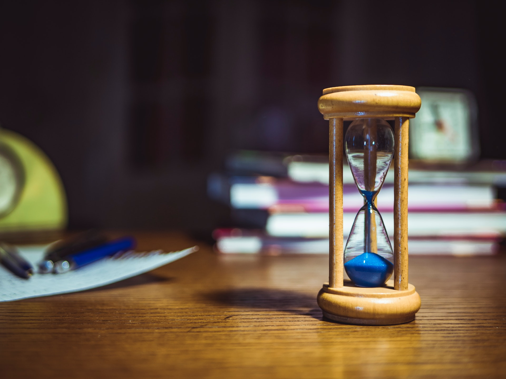

# `Horology`

[](https://lgtm.com/projects/g/mjmikulski/horology/context:python)
[](https://lgtm.com/projects/g/mjmikulski/horology/alerts/)
[](https://pepy.tech/project/horology)
[](https://badge.fury.io/py/horology)

[](https://circleci.com/gh/mjmikulski/horology/tree/master)

Conveniently measures the time of your loops, contexts and functions.




## Installation
Simply:
```
pip install horology
```

Works with python versions 3.6, 3.7, 3.8 and 3.9. Tested on Linux, Windows and MacOS.

## Usage
The following 3 tools will let you measure practically any part of your Python code.

### Timing an iterable (list, tuple, generator, etc)
#### Quick example
```python
from horology import Timed

animals = ['cat', 'dog', 'crocodile']

for x in Timed(animals):
    feed(x)
```
Result:
```
iteration    1: 12.0 s
iteration    2: 8.00 s
iteration    3: 100 s

total 3 iterations in 120 s
min/median/max: 8.00/12.0/100 s
average (std): 40.0 (52.0) s

```

#### More cool stuff:
You can specify where (if at all) you want each iteration and summary to be printed, eg.:
```python
for x in Timed(animals, unit='ms', 
               iteration_print_fn=logger.debug, 
               summary_print_fn=logger.info):
    feed(x)
```


### Timing a function with a `@timed` decorator
#### Quick example
```python
from horology import timed

@timed
def foo():
    ...
```
Result:
```
>>> foo()
foo: 7.12 ms
```

#### More cool stuff:
Personalize time unit and name
```python
@timed(unit='s', name='Processing took ')
def bar():
    ...
```
Result:
```
>>> bar()
Processing took 0.185 s
```


### Timing part of code with a `Timing` context
#### Quick example
Just wrap your code using a `with` statement
```python
from horology import Timing

with Timing(name='Important calculations: '):
    ...
```
Result:
```
Important calculations: 12.4 s
```

#### More cool stuff:
You can suppress default printing and directly use measured time (also within context)
```python
with Timing(print_fn=None) as t:
    ...
    
make_use_of(t.interval)
```


## Time units
Time units are by default automatically adjusted, for example you will see
`foo: 7.12 ms` rather than `foo: 0.007 s`. If you don't like it, you can 
override this by setting the `unit` argument with one of these names: 
`['ns', 'us', 'ms', 's', 'min', 'h', 'd']`.


## Contributions 
Contributions are welcomed, see [contribution guide](.github/contributing.md).


## Internals
Horology internally measures time with `perf_counter` which provides the *highest available resolution,*
 see [docs](https://docs.python.org/3/library/time.html#time.perf_counter).
