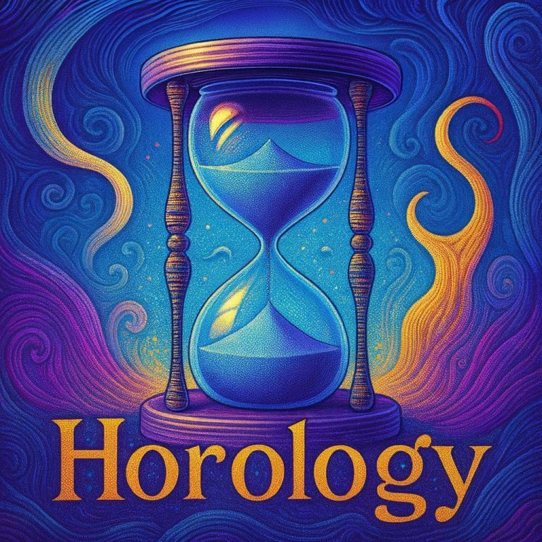

# `Horology`

[](https://badge.fury.io/py/horology)
[](https://github.com/mjmikulski/horology/actions/workflows/tests.yaml)
[](https://github.com/mjmikulski/horology/actions/workflows/codeql.yaml)
[](https://pypi.org/project/horology/)
[](https://pypi.org/project/horology/)
[](https://pepy.tech/project/horology)
[](https://opensource.org/licenses/MIT)


Conveniently measures the time of your loops, contexts and functions.



## Installation

| horology version | compatible python |
|------------------|-------------------|
| 1.5              | 3.11-3.15         |
| 1.4.2            | 3.10-3.14         |
| 1.4.1            | 3.10-3.13         |
| 1.4              | 3.10-3.12         |
| 1.3              | 3.8-3.11          |
| 1.2              | 3.6-3.9           |
| 1.1              | 3.6-3.8           |

Horology can be installed with pip. It has no dependencies.

```
pip install horology
```

## Usage

The following 3 tools will let you measure practically any part of your Python code.

### Timing an iterable (list, tuple, generator, etc.)

#### Quick example

```python
from horology import Timed

animals = ['cat', 'dog', 'crocodile']

for x in Timed(animals):
    feed(x)
```

Result:

```
iteration    1: 12.0 s
iteration    2: 8.00 s
iteration    3: 100 s

total 3 iterations in 120 s
▁▁█
min/median/max: 8.00/12.0/100 s
average (std): 40.0 (52.0) s

```

#### Customization

You can specify where (if at all) you want each iteration and summary to be printed, e.g.:

```python
for x in Timed(animals, unit='ms',
               iteration_print_fn=logger.debug,
               summary_print_fn=logger.info):
    feed(x)
```

The sparkline (`▁▁█`) of all iteration times can be turned off with `sparkline=False`.

### Timing a function with a `@timed` decorator

#### Quick example

```python
from horology import timed


@timed
def foo():
    ...
```

Result:

```
>>> foo()
foo: 7.12 ms
```

#### Customization

Choose time unit and name:

```python
@timed(unit='s', name='Processing took')
def bar():
    ...
```

Result:

```
>>> bar()
Processing took 0.185 s
```

### Timing part of code with a `Timing` context

#### Quick example

Just wrap your code using a `with` statement:

```python
from horology import Timing

with Timing(name='Important calculations:'):
    ...
```

Result:

```
Important calculations: 12.4 s
```

#### Customization

You can suppress default printing and directly use measured time (also within the context):

```python
with Timing(print_fn=None) as t:
    ...

make_use_of(t.interval)
```

## Async code

All three tools work with async code as well:

```python
@timed
async def fetch(url):
    ...

async with Timing(name='Downloading:'):
    ...

async for page in Timed(fetch_pages()):
    ...
```

## Failures

If the timed code raises an exception, the time elapsed is printed with `(failed)` and also added to the
exception, so you can see it right in the traceback, even if printing is turned off:

```
fetch: 1.5 s (failed)
Traceback (most recent call last):
  ...
TimeoutError: https://example.com
horology: fetch: 1.5 s (failed)
```

## Time units

Time units are by default automatically adjusted, for example you will see
`foo: 7.12 ms` rather than `foo: 0.007 s`. If you don't like it, you can
override this by setting the `unit` argument with one of these names:
`['ns', 'us', 'ms', 's', 'min', 'h', 'd']`.

## Contributions

Contributions are welcome, see [contribution guide](.github/contributing.md).

## Internals

Horology internally measures time with `perf_counter`, which provides the *highest available resolution,*
see [docs](https://docs.python.org/3/library/time.html#time.perf_counter).
